# Group Information
   - Chalani Dissanayaka
   - Rahul Dayal
   - Jason Parkin

# R1 - Description of Website

> Description of your website, including: Purpose, Functionality / features, Target audience and Tech stack

## Purpose

Bean Buzz is a MERN stack application designed to address operational inefficiencies in cafes and restaurants while doubling as a portfolio piece to demonstrate Coder Academy graduates' expertise in front-end and back-end technologies, API design and data management within a professional and real-world application.

<b>Key Goals:</b>

- Showcase Expertise in modern web development practices.
- Solve real-world problems faced by food service businesses.
- Create a user focused tool with busuness enhancing features.

## Problem Statement

#### Inflexible Printed Menus

Cafes and restaurants are a dynamic environment. The food items available often change on both a seasonal and daily basis.

- On a seasonal basis, restaurants may need to create and remove menu items based on the ingredients that are available locally.
- On a daily basis, restaurants may need to toggle the availability of menu items based on the current amount of ingredients left available.

Over time, managing these changes on a printed menu can be time consuming and costly. This may discourage restaurants from experimenting with menu items and trying new things in the short-term.

#### Long Wait Times

Long wait times can really hurt the experience for takeaway customers. Without a clear way to track their order, they’re often left waiting and wondering if their food is ready or if it’s been forgotten. 
This gets even worse in busy places where the staff is too swamped to give regular updates. The lack of communication and transparency can leave customers feeling frustrated and less likely to come back, especially if other nearby options offer a smoother, more reliable experience.

#### Lost Paper Tickets for Orders

Paper order systems can be a real headache. Tickets get lost or damaged, causing delays, and unhappy customers. When things get busy, keeping track of what’s done and what still needs attention becomes a mess. 
Plus, trying to manage order history, revenue, and other important info manually takes way too much time and makes it harder to make smart business decisions. In the end, relying on paper slows everything down, makes life harder for staff, and leaves customers disappointed.

#### Customer Retention

Restaurants and cafes may struggle to give incentive for their customers to come back frequently. With so many places offering similar food and experiences, it’s hard to stand out and build loyalty.
This can lead to inconsistent revenue and make it tough to grow or stay sustainable in the long run. In areas packed with dining options, not focusing on customer loyalty can make it even harder to stand out and succeed.

## Features & Functionality

### For Customers

1.  <b>Dynamic Menu</b> 
    The app will feature a dynamic menu that can be filtered by customers based on a variety of dietary requirements. Cafe and Restaurant staff will also be able to toggle the availability of menu items - this ensures that customers are aware of the availability of menu items prior to ordering.

    - Filter by dietary needs (vegan, gluten free)
    - See real-time availability of menu items

2.  <b>Order Placement</b> 
    The app will feature an ordering system to allow users to select menu items, leave instructions / special requests and pay for their menu items.

    - Add items to cart, specify special requests and complete payment via Stripe

3.  <b>Order Tracking</b> 
    The app will feature an order tracking system to allow customers to view the status of their order.

    - Track the progress of orders from placement to completion

4.  <b>User Account Management</b> 
    Customers can create a personal account to save their preferences, past orders, and contact details for faster future transactions.
    Logged-in users can view and update their profile information, such as delivery addresses, payment details, and contact numbers.

5.  <b>User Loyalty Program</b> 
    Customers are given incentive to use the app and visit the cafe /restaurant in order to earn discounts after spending a certain amount of money or purchasing a certain amount of products.

    - Customers are rewarded for their loyalty through a points-based system, where they earn points for every purchase
    - The program offers transparency by allowing users to track their progress toward rewards directly within the app.

### For Businesses

1.  <b>Admin Dashboard</b> 
    Business owners will be able to create, update and delete menu items using a dashboard in the app.

    - Real-time updates to menu availability ensure customers see only what is currently available, minimising order issues related to unavailable items.
    - The dashboard includes analytics on menu performance, helping businesses identify bestsellers and underperforming items.

2.  <b>Order Dashboard</b> 
    Kitchen staff and business owners will be able to view past and present orders. Furthermore, they’ll be able to confirm or cancel present orders.

    - Kitchen staff and business owners can view all current, pending, and completed orders in one centralised system.
    - Orders are categorised by status (“In Progress,” “Completed”) to streamline kitchen operations and improve workflow efficiency.
    - Businesses can confirm or cancel orders directly through the dashboard, providing flexibility to address errors or handle special circumstances.

## Target Audience

The target audience for this application are restaurant / cafe owners, their staff and customers. Restaurant / cafe owners and their staff will use this application to streamline their business operations - keeping menus up-to-date and taking and managing orders. Customers will use this application to browse menu items, make orders and keep track of their rewards.

#### Primary Users:

1. <b>Cafe/Restaurant Owners</b>

   - Mange their operations seamlessly
   - Track orders, streamline menu updates, and gain customer insights

2. <b>Cafe/Restaurant Staff</b>
   - Simplify kitchen and front of house workflows
   - Reduce errors in order management

#### Secondary Users:

1. <b>Authenticated Customers</b>
   - Benefit from a personalised ordering experience with real-time updates, access to loyalty rewards, and saved preferences for quicker checkouts.
2. <b>Unauthenticated Customers</b>
   - Enjoy a simple and efficient ordering process with real-time updates, without needing to create an account.

## Tech stack

The application implements a variety of technologies associated with the MERN stack. They include the following:

### Front-end

1.  <b>React.js</b> 
    React.js is the front-end Javascript library that the app uses to render and update the user interface. The front-end of the application will be hosted on Netlify. - Renders the UI dynamically - Manages state for user interactions like menu filtering and order placement

### Back-end

1.  <b>Node.js</b> 
    Node.js allows the application to make use of a variety of web development frameworks and libraries such as express, mongoose and helmet.js.

    - Provides the runtime environment for the server side code.

2.  <b>Express.js</b> 
    Express.js is a web application framework for Node.js that is used to handle server-side logic such as authentication, authorisation and CRUD operations relating to menu-items, users and orders. The express server itself is hosted on Render.

    - Manages server logic like routing, authentication, and API endpoints.

### Database

1.  <b>MongoDB</b> 
    MongoDB is the NoSQL database used for this application hosted on Cloud Atlas.

    - Stores Collections for users, menu items, orders, and loyalty rewards
    - Hosted on Cloud Atlas for robust performance and scalability

### Payment Gateway

1.  <b>Stripe</b> 
    Stripe is the payment processing platform used by the application for customer orders.

    - Processes payments securely and integrates seamlessly with the app.

### Deployment

1. <b>Front-end</b> 

   - Deploy React.js on Netlify.

2. <b>Back-end</b> 

   - Deploy Node.js/Express on Render.

3. <b>Environment Variables</b> 
   - Storing sensitive information such as API keys and database URIs securely.

# R2 - Dataflow Diagram

### Overview

A Dataflow Diagram is a simple way to show how data moves through a system. It highlights the processes, data storage areas, and how external entities interact with the system. It's a handy tool for designing software, analysing systems, and mapping out processes.

1. <b>External Entities:</b> Represent users (basic user, account user, admin, staff).
2. <b>Processes:</b> Represent actions performed within the system (login, update user profile, menu management, order management).
3. <b>Data Stores:</b> Represent databases for menus, orders, tables, and users.
4. <b>Data Flow:</b> Depicted with arrows showing data input, processing, and output.

## Key Processes

### User Registration and Login

1. External Entity
   - User
2. Processes
   - <b>Register:</b> A user provides registration details, which are stored in the `User Database`
   - <b>Login:</b> Users input credentials to verify their identity. Verified users are categorised as:
     - <b>Basic User:</b> Can access limited functionalities.
     - <b>Account User:</b> Can access full account features (profile updates).
     - <b>Admin/Staff:</b> Get access to management controls for menus, orders, and tables.
   - <b>User Authentication:</b> Data flows from the User Database to confirm credentials.
3. Data Store:
   - User Database (Stores user details like name, email, and contact info).

### Menu Management

1. External Entity:
   - Admin
   - Staff
2. Processes:
   - <b>Read Menu:</b> Retrieve menu details from the `Menu Database`.
   - <b>Get Menu Items by Category:</b> Allows filtering based on categories.
   - <b>Add/Edit/Delete Menu Item:</b>
     - <b>Add:</b> New menu items are created in the database.
     - <b>Edit:</b> Updates existing menu details.
     - <b>Delete:</b> Removes items from the database.
3. Data Store: Menu Database (Stores menu items and associated details).

Menu data is also shared with `Order Management` for placing orders.

### Order Management

1. External Entity:
   - Basic Users
   - Account Users
   - Admin
   - Staff
2. Processes:
   - <b>Create an Order:</b> Users place orders, with details recorded in the `Orders Database`.
   - <b>Get Order by ID:</b> Retrieve specific order details.
   - <b>Update Order:</b> Modify order details (status).
   - <b>Submit Order:</b> Finalises the order for processing.
   - <b>Delete Order:</b> Cancel or remove orders.
3. Data Store: Orders Database (Stores order details such as items, quantities, user IDs, and status).

`Admins` and `Staff` can view order summaries for reporting purposes (daily totals, item counts).

### Table Management

1. External Entity:
   - Admin
   - Staff
2. Processes:
   - <b>Get All Tables:</b> Retrieve table details from the `Table Database`.
   - <b>Add/Edit/Delete Table:</b>
     - <b>Add:</b> Adds new table entries.
     - <b>Edit:</b> Updates existing table information (availability).
     - <b>Delete:</b> Removes tables from the system.
3. Data Store: Table Database (Tracks table numbers, availability, and statuses).

Table data is synchronised with `Order Management` for assigning orders to tables.

### User Profile Management

1. External Entity:
   - Account Users
2. Processes:
   - <b>Read User Profile:</b> Users retrieve their profile information from the `User Database`.
   - <b>Update User Profile:</b> Allows users to edit their account information.
3. Data Store: User Database

### System Roles and Permissions

1. Basic Users: Limited access (view menus, place orders).
2. Account Users: Extended access (profile updates).
3. Admin/Staff:
   - Manage menus, orders, and tables.
   - Access data summaries (order statistics).

 

Click here - Dataflow Diagram

<i>Revision 01</i>

<i>Revision 02 - Added tables and ordering databases</i>

<i>Revision 03 - Added database structures + annotation</i>

# R3 - Application Architecture Diagram

### Overview

Our application utilises a MERN stack, featuring a React.js front-end, a Node.js and Express.js server, and a MongoDB database. External APIs are utilised for payment processing and map rendering. The following is a more detailed breakdown of the application architecture:

1. The React.js app sends CRUD requests to the Express.js Server.

2. The Express.js Server processes these requests using the authentication, model and payment controllers.

3. The server queries the MongoDB database or creates new documents and adds them to the database.

4. The database sends documents back to the server.

5. The server sends a response containing data back to the front-end.

6. If the payment controller is utilised, it sends a payment object to the STRIPE payment API server and receives a success or failure status as a response.

7. If the Gmp-map component is rendered, it makes a GET request to the Google Maps API server and receives a response with map data.

Click here - Application Architecture Diagram

# R4 - User Stories

### Overview

A user story is a simple way to explain a feature or function from the perspective of the person using it. It answers three key questions: <b><i>who’s</b></i> using it, <b><i>what</b></i> they want to do, and <b><i>why</b></i> it’s important to them. This helps ensure that features are designed with real users in mind and create a great experience.

- Who: Defines the type of user, like a customer, admin, or kitchen staff.
- What: Describes the action the user wants to take.
- Why: Explains the purpose or benefit behind the action, showing why it matters.

Our user stories have been refined throughout the creation of this app.  
The following are the multiple versions:

## User Stories - Version 1

### Dynamic Digital Menu

#### Customer

1. As a customer, I want to view a digital menu so I can see all food items available.

2. As a customer, I want to filter food items based on my dietary requirement (e.g, vegan or gluten free) so I can order food that is suitable for me.

### Online Ordering & Payment

#### Customer

1. As a customer, I want to be able to pay for my food online while heading to the cafe / restaurant so it will be ready to pick up when I get there.

2. As a customer, I want to be able to pay for my food online while dining in because it will save me time.

### Food Item Dashboard

#### Business Owner

1. As a business owner, I want to be able to view current food items so I know what’s being offered to customers.

2. As a business owner, I want to be able to update food items and keep them up-to-date if there are any changes that need to be made (like changes to price).

3. As a business owner, I want to be able to create food items so our business can periodically offer customers something new and interesting to try.

4. As a business owner, I want to be able to toggle the availability of food items on the digital menu to reflect what we currently have in stock, prevent customers from being disappointed and save our staff time in having to explain that certain items are not currently available.

### Order Dashboard

#### Customer

1. As a customer, I want to be able to track the current state of my order so I know when it’s ready for pickup.

#### Business Owner

1. As a business owner, I want to be able to track all orders (past and present) to keep up-to-date business records.

#### Kitchen Staff

1. As kitchen staff, I want to be able to view current orders along with the customer instructions associated with them, mark them as complete or cancel them.

### User Registration, Login and Loyalty Program

#### Customer

1. As a customer, I want to be able to register an account and login so I can keep track of my orders and know when they’re ready to pick up.

2. As a customer, I want to be able to accrue points so I can use them to order free food items.

#### Business Owner

1. As a business owner, I want to be able to provide an incentive for my customers to visit and order food regularly.

## User Stories - Version 2

_Note: version 2 adds expands on user actions and introduces new actions including, but not limited to, removing items from the cart, specifying order quantities, and viewing food items that are sold out._

### Dynamic Digital Menu

#### User

1. As a user, I want to view a digital menu so I can see all current food items. When doing so, i also want to know which food items are currently sold out so i do not order them.

#### Customer

1. As a customer, I want to filter food items based on my dietary requirement (e.g, vegan, gluten free, vegetarian, etc.) so I can order food that is suitable for me.

### Ordering

#### Customer

1. As a customer, I want to be able to add food items to a cart so I can continue to browse the menu.

2. As a customer, I want to be able to specify the quantity of food items I want to buy so i can order on behalf of everyone on my table.

3. As a customer, i want to be able to remove food items from my cart if I change my mind.

### Payment

#### Customer

1. As a customer, I want to be able to pay for my food online while heading to the cafe / restaurant so it will be ready to pick up when I get there.

2. As a customer, I want to be able to pay for my food online while dining-in because it will save me time in going to the counter and having to talk to staff.

3. As a customer, I want to be able to pay for my food in person with cash after I have placed my order online.

### Food-Item Dashboard

#### Business Owner

1. As a business owner, I want to be able to view current food items so I know what’s being offered to customers.

2. As a business owner, I want to be able to update food items and keep them up-to-date if there are any changes that need to be made (like changes to price).

3. As a business owner, I want to be able to create food items so our business can periodically offer customers something new and interesting dishes to try.

4. As a business owner, I want to be able to toggle the availability of food items on the digital menu to reflect what we currently have in stock, prevent customers from being disappointed and save our staff time in having to explain that certain items are sold out.

### Order Dashboard

#### Customer

1. As a customer, I want to be able to track the current state of my order so I know when it’s ready for pickup.

#### Business Owner

1. As a business owner, I want to be able to track all orders (past and present) to keep up-to-date business records.

#### Kitchen Staff

1. As kitchen staff, I want to be able to view current orders along with the customer instructions associated with them, mark them as complete or cancel them.

### User Registration, Login and Loyalty Program

#### Customer

1. As a customer, I want to be able to register an account and login so I can keep track of my orders and know when they’re ready to pick up.

2. As a customer, I want to be able to accrue points so I can use them to order free food items.

#### Business Owner

1. As a business owner, I want to be able to provide an incentive for my customers to visit and order food regularly.

## User Stories - Version 3

_Note: In response to the feedback received from the group presentations, version 3 introduces more fleshed out sample personas to the user stories._

Our app supports 3 types of users:

### 1. Persona - Unauthenticated user (a user that is not logged in)

James is a tourist from England who is visiting Sydney for 2 days. He wants to grab a cup of coffee from Bean Buzz while he walks around to see the local sites. Because James travels a lot, he does not want to have to register accounts and share his personal data to use services he will only use once. Furthermore, James has a credit card to make purchases. He often prefers to use cash while traveling.

### 2. Persona - Authenticated user (a user that has a registered account and is logged in)

Lisa is a local living in Sydney who visits Bean Buzz for a cup of coffee and breakfast every week. Because she visits the cafe frequently, she has registered an account to participate in the loyalty program and receive discounts. Sometimes, when she is in a rush, she needs to make an order online and pay for it prior to arriving at the cafe.

### 3. Persona - Owner, admin or staff user

Priya is the owner / admin of Bean Buzz. Every few months, she likes to update her menu item to offer desserts that are trendy. Because certain food items are in high demand and sell out early, Priya will have to toggle certain food items as unavailable. At the end of the day, Priya also likes to check all the orders that were made for bookkeeping purposes.

Tony works as a chef in the kitchen of Bean Buzz. Tony frequently checks instructions on orders to avoid having them sent back to the kitchen. Tony also needs to cancel orders if he discovers they do not have enough ingredients to make it or confirm orders once they are completed and ready to be picked up.

### Unauthenticated User - User Story

1. As an unauthenticated user, I want to access the application and view menu items without needing to log in, so I can explore the options available.
2. As an unauthenticated user, I want to filter food items based on my dietary requirements (e.g., vegan or gluten-free) so I can find suitable food items easily.
3. As an unauthenticated user, I want to order food online without logging in, but I understand that I won't have access to order status updates or the loyalty program.
4. As an unauthenticated user, I want to be able to pay for my food online
5. As an unauthenticated user, I want to be able to register an account so i can login to track my orders and participate in the loyalty program
6. As an unauthenticated user, I want to be able to pay for my order online to save time.
7. As an unauthenticated user, I want to be able to pay for my order in person so i can use cash.

### Authenticated User - User Story

1. As an authenticated user, I want to filter food items based on my dietary requirements (e.g., vegan or gluten-free) so I can order food online that suits my preferences.
2. As an authenticated user, I want to pay for my food online while heading to the cafe or restaurant so I can save time during pick-up or delivery.
3. As an authenticated user, I want to track the status of my orders (e.g., pending, completed or cancelled) so I can stay updated.
4. As an authenticated user, I want to access a loyalty program so I can earn points with each order and redeem them for free food items.
5. As an authenticated user, I want to be able to pay for my order online to save time.
6. As an authenticated user, I want to be able to pay for my order in person so i can use cash.

### Admin or Staff User - User Story

1. As an owner/admin, I want to log in to the app so I can manage the restaurant’s menu, orders, payments and overall operations.
2. As a business owner/admin, I want to view the current menu items so I know what is being offered to customers.
3. As a business owner/admin, I want to update menu items (e.g., prices, image or descriptions) so the menu remains accurate and up-to-date.
4. As a business owner/admin, I want to create new menu items so our restaurant can periodically offer new dishes to customers.
5. As a business owner/admin, I want to toggle the availability of menu items on the digital menu so I can reflect real-time stock levels, preventing customer disappointment and saving staff time.
6. As a business owner/admin, I want to track all orders (past and present) so I can maintain up-to-date business records and analyse order trends.
7. As a business owner/admin, I want to change the status of orders (e.g., pending, completed, canceled) to manage and organise operations effectively.
8. As kitchen staff, I want to view current orders along with any customer instructions so I can prepare the orders accurately.
9. As kitchen staff, I want to mark orders as pending, completed, or canceled so I can communicate their status to the customers.

## User Stories - Version 4

_Note: The structure of the user stories have been changed so they're more closely connected to the sample personas created in version 3._

Our app supports 3 types of users:

### 1. Persona - Unauthenticated User (A User That Is Not Logged In)

James is a vegan tourist from England who is visiting Sydney for 2 days. He wants to grab a dairy-free cup of coffee from Bean Buzz while he walks around to see the local sites. Because James travels a lot, he does not want to have to register accounts and share his personal data to use services he will only use once. Furthermore, James has a credit card to make purchases. He often prefers to use cash while traveling.

#### User Stories

1. As an unauthenticated user, James wants to access the application and view menu items without needing to log in, so he can explore the options available without having to share personal information with the application.
2. As an unauthenticated user, James wants to filter food items based on his dietary requirement (vegan) so he can find suitable food items easily.
3. As an unauthenticated user, James wants to order food online without logging in, but he understands that he won't have access to order tracking or the loyalty program.
4. As an unauthenticated user, James wants to be able to pay for his food online using a credit card if he does not have cash on him.
5. As an unauthenticated user, James wants to be able to pay for his orders in person so he can use cash if he has enough on him.
6. As an unauthenticated user, James wants to be able to register an account if he wants to access features available to authenticated users such as order tracking and the loyalty program.

### 2. Persona - Authenticated User (A User That Has A Registered Account And Is Logged In)

Lisa is a local living in Sydney who visits Bean Buzz for a cup of coffee and breakfast every week. Because she visits the cafe frequently, she has registered an account to participate in the loyalty program and receive discounts. Sometimes, when she is in a rush, she needs to make an order online and pay for it prior to arriving at the cafe. Furthermore, Lisa also has Celiac disease and needs to ensure the dishes she orders are gluten-free.

#### User Stories

1. As an authenticated user, Lisa wants to filter food items based on her dietary requirements (gluten-free) so she can order food online that is safe for her to eat.
2. As an authenticated user, Lisa wants to be able to pay for her food online while heading to the cafe so she can save time.
3. As an authenticated user, Lisa wants to be able to pay for her order online while dining-in to save time.
4. As an authenticated user, Lisa wants to be able to pay for her order in person so that she can use cash.
5. As an authenticated user, Lisa want to track the status of her orders (e.g., pending, preparing and completed) so she can stay updated and know when to pick it up.
6. As an authenticated user, Lisa wants to access a loyalty program so she can earn points with each order and redeem them for free food items.
7. As an authenticated user, Lisa wants to be able to give feedback to the restaurant by writing a review in order to help them improve their service.
8. As an authenticated user, Lisa wants to be able to change her user profile details such as email and online payment method so they can stay up-to-date.

### 3. Persona - Owner or Admin

Priya is the owner/admin of Bean Buzz. Every few months, she likes to update her menu item to offer desserts that are trendy. Because certain food items are in high demand and sell out early, Priya will have to toggle certain food items as unavailable. At the end of the day, Priya also likes to check all the orders that were made for bookkeeping purposes.

#### User Stories

1. As an business owner/admin, Priya wants to log in to the app so she can manage the cafe's menu, orders, payments and overall operations.
2. As a business owner/admin, Priya wants to view the current menu items so she knows what is being offered to customers.
3. As a business owner/admin, Priya wants to update menu items (e.g., prices, image or descriptions) so the menu remains accurate and up-to-date.
4. As a business owner/admin, Priya wants to create new menu items so the cafe can periodically offer new dishes to customers.
5. As a business owner/admin, Priya wants to toggle the availability of menu items on the digital menu so it can reflect real-time availability, preventing customer disappointment and saving staff time.
6. As a business owner/admin, Priya wants to track all orders (past and present) so she can maintain up-to-date business records and analyse order trends.
7. As a business owner/admin, Priya wants to change the status of orders (e.g., pending, completed, canceled) to manage and organise operations effectively.

### 4. Persona - Staff

Tony works as a chef in the kitchen of Bean Buzz. Tony frequently checks instructions on orders to avoid having them sent back to the kitchen. Tony also needs to cancel orders if he discovers they do not have enough ingredients to make it or confirm orders once they are completed and ready to be picked up.

#### User stories

1. As kitchen staff, Tony wants to view current orders along with any customer instructions so he can prepare the orders accurately.
2. As kitchen staff, Tony wants to mark orders as pending, completed, or canceled so he can communicate their status to the customers and other staff.

# R5 - Wireframes for multiple standard screen sizes

> Wireframes for multiple standard screen sizes, created using industry standard software

[Figma Wireframe Link](https://www.figma.com/design/opDtX5ia73tgRQuhVsJ3fT/Been-Buzz-Cafe-Wireframes?node-id=0-1&t=TIgoX4YxbvIukJd8-1)

### Overview

Designed high-fidelity wireframes for multiple standard screen sizes using Figma, the industry-standard design tool. These wireframes ensure a responsive and user-friendly layout across devices such as desktops, tablets, and mobile screens. That helps reflecting the app's final design and functionality. Figma's collaborative features allowed our team to iterate and refine the designs efficiently, aligning with best practices for modern UI/UX development.

### Colour Selection

For the "BeanBuzz" app, we used the "Coolors" color palette generator to create a darker coffee-inspired color scheme for the wireframes. The rich, earthy tones of coffee beans capture the warmth and elegance of a cozy café atmosphere. This palette reflects the dining experience while creating a visually appealing and immersive interface, enhancing the user’s connection to the app.

- [Colour Theme 1](https://coolors.co/000000-251b0f-967c70-e8d4c4-f1f5f2)
- [Colour Theme 2](https://coolors.co/000000-241b17-e68541-f6f1ef-ffffff)
- [Colour Theme 3](https://coolors.co/000000-202738-c46c48-e7ddda-efefef)

Click here - Colour Themes Images

<i>Theme 01</i>

<i>Theme 02</i>

<i>Theme 03</i>

### Font Selection

When selecting fonts for our app, readability and modern appeal were top priorities. The chosen fonts create a clean, approachable aesthetic, making them perfectly suited for menu displays and user interfaces. These fonts work well together to create a consistent and welcoming design for the app. In the end, we chose:

- Open Sans
- Lato

### Mobile View

We initiated the design process for the app by focusing on the mobile version. Using Figma, we chose the "iPhone 13 mini" view to ensure accurate design alignment.
Then devised the design for the mobile version as follows.

### Tablet View

For the tablet view in Figma, used the "Android Expanded" frame to ensure the design adapts smoothly to larger screens. This choice allows for an optimised, responsive layout across tablet devices.

### Desktop View

In Figma, we used the desktop frame for the desktop view to design an interface customised for larger screens. This approach ensures a smooth, responsive experience for users across desktop devices.

## Pages

### Home Page

The page highlights featured items, customer reviews, and information banners. Navigation links and business information are consistently placed for accessibility.

Encourages users to explore the menu, learn about the cafe, and follow the business on social media. Clear navigation buttons guide users to other sections.

The home page serves as the central hub, connecting to all major sections like the menu, contact, and user account pages.

> <i>Click to view below</i>

Mobile View

Tab View

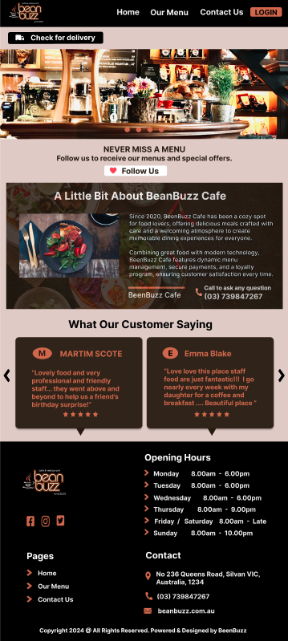

Desktop View

### Our Menu Page

Menu items are categorised and displayed with accompanying images and descriptions. Filters and category tabs enhance content organisation.

Users can browse, filter, and order items directly from the page. "Order Now" buttons are clearly placed for quick interaction.

The menu page links to the cart, filters, and order details, ensuring a seamless browsing and ordering experience.

> <i>Click to view below</i>

Mobile View

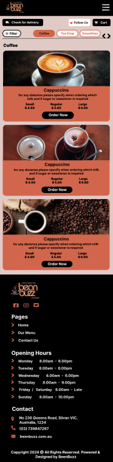

Tab View

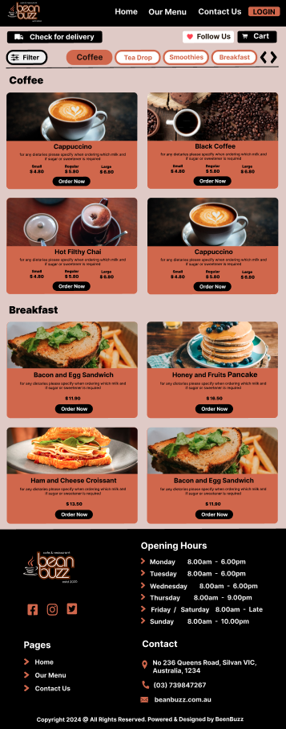

Desktop View

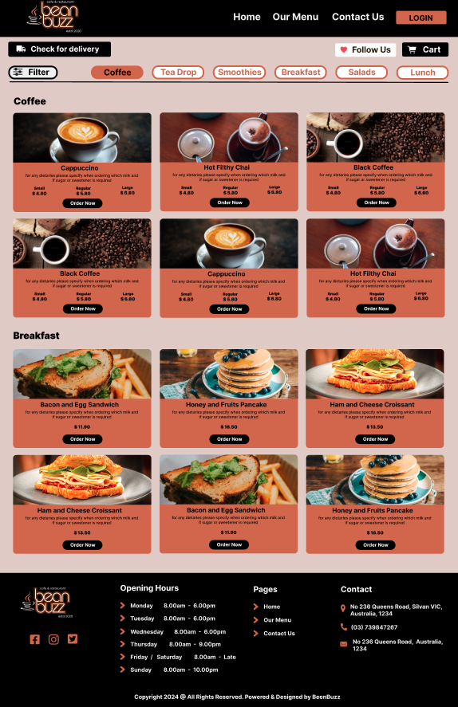

### Contact Page

The page splits content into a contact form and a map for location details. Additional contact options (phone and email) are displayed prominently below the form.

Encourages users to reach out via the form or provided contact methods. The clear design reduces barriers to communication.

Links to the home and menu pages, ensuring easy navigation for users needing support or inquiries.

> <i>Click to view below</i>

Mobile View

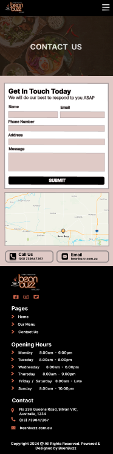

Tab View

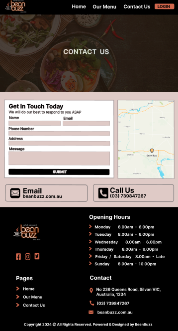

Desktop View

### Register Page

Fields for personal details like name, email, and phone number are well spaced and intuitive, ensuring a smooth registration process.

Encourages new user registration with a prominent "Register Now" button. The focus is on simplicity and ease of use.

Directly connects to the login page and user account dashboards, ensuring a seamless confirmation.

> <i>Click to view below</i>

Mobile View

Tab View

Desktop View

### Login Page

The login form is centered on the page with clear fields for email and password. There's also a "Create an Account" button for new users.

It encourages users to sign in while providing an easy option to create a new account. The simple layout keeps the login process straightforward and user friendly.

The form links directly to the registration page and personalised user dashboards, ensuring a smooth and seamless onboarding experience.

> <i>Click to view below</i>

Mobile View

Tab View

Desktop View

### User Profile Page

The profile page is organised into sections for account details, user reviews, rewards, and current order details. Each section is visually separated for clarity, ensuring users can focus on specific tasks, like updating personal information or checking their rewards balance. Labels and expandable panels enhance content organisation.

Users can update their profile information, submit reviews and feedback, check their loyalty rewards balance, and view or proceed with their current order. "Save Changes," "Submit Review," and "Redeem My Rewards" buttons ensure smooth interaction for each functionality.

The profile page connects seamlessly to the loyalty program, order details, and feedback system. It integrates with the menu and checkout pages, allowing the user to manage personal information, orders, and rewards.

> <i>Click to view below</i>

Mobile View

Tab View

Desktop View

### Admin Dashboard Page

The panel is organised into tabs for easy navigation: Home, Menu Items, Orders, and Payments. Order details are clearly displayed in a table, highlighting key information for quick access.

Admins can easily view, update, and manage orders and payments, with full control over the system.

It also integrates seamlessly with kitchen staff dashboards and the customer ordering system, ensuring that all updates are synchronised in real-time.

> <i>Click to view below</i>

Mobile View

Tab View

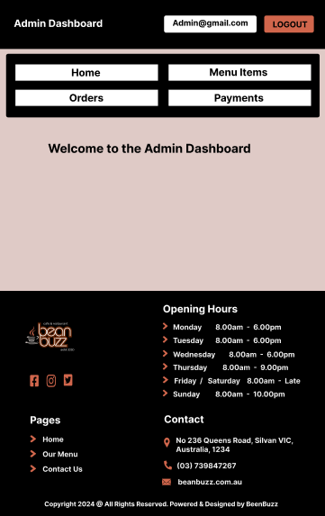

Desktop View

### Admin Dashboard - Menu Management Panel Page

The panel displays menu items in a table layout, showing key details like name, price, size, type, and images. The "Add Item" button is easily accessible for quick updates. Action buttons for "Edit" and "Delete" allow management of individual items.

Admins can add new menu items, modify existing ones, or remove outdated entries. The table simplifies managing details like pricing, categorisation, and images. These functions help keep the menu up to date with ease.

This panel is connected to the customer menu and order sections, ensuring that any changes made are reflected across the system. It also integrates with the payments and order panels to maintain consistency in pricing and availability.

> <i>Click to view below</i>

Mobile View

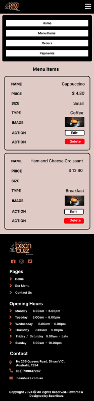

Tab View

Desktop View

### Admin Dashboard - Order Management Panel Page

This presents key order details such as order codes, items, quantity, table numbers, order time, completed time, actions, and cost in a clean, easy to read format. The sidebar allows for quick navigation between home, menu items, orders, and payments.

Admins can update order statuses to "Complete" and track orders in real time. The table enables verification of order details, ensuring accuracy in operations. The design streamlines order management with quick and easy updates.

This panel integrates with the kitchen staff dashboard, payments section, and the customer ordering system. Updates made here are reflected across all related screens in real time, ensuring smooth communication between admins, staff, and customers.

> <i>Click to view below</i>

Mobile View

Tab View

Desktop View

### Admin Dashboard - Payment Management Panel Page

The view neatly organises important payment details like order codes, items, quantities, order times, payment methods, discounts, and totals, making them easy to review. A sidebar provides quick links to other admin sections, such as home, menu items, and orders. Its clean design ensures admins can focus on key financial information without distractions.

Admins can easily review payments, verify transactions, and track payment methods, including cash and credit cards (via Stripe). The panel simplifies financial management by clearly displaying discounts and order totals, ensuring transactions are tracked accurately.

This panel integrates seamlessly with the orders dashboard and the admin system. Payment data is automatically linked to order details, keeping everything consistently updated. It supports smooth navigation and reliable bookkeeping, making financial oversight straightforward.

> <i>Click to view below</i>

Mobile View

Tab View

Desktop View

### Kitchen Staff Dashboard Page

The dashboard is designed for simplicity, featuring a sidebar that provides easy access to Home and Orders. The main area is open and welcoming, allowing space to display order details or other updates. This clean layout helps staff stay focused and avoid distractions.

Staff can easily switch between the main dashboard and the orders section. This setup makes it quick and simple to view and update orders. The user friendly interface streamlines daily tasks.

The dashboard connects directly to the orders panel, where staff can manage and track order progress. It seamlessly integrates with both the admin and user systems, ensuring that updates are reflected in real time across the platform.

> <i>Click to view below</i>

Mobile View

Tab View

Desktop View

### Kitchen Staff Dashboard - Order Management Panel Page

The orders panel uses a table format to display order details such as order codes, items, quantities, table number, order time and statuses.
The "Complete" and "Pending" statuses are clearly highlighted for easy tracking.
This layout helps staff focus on managing active orders with ease.

Kitchen staff can quickly view and update order statuses in real time.
The "Complete" status allows the staff user to view quick updates, ensuring accurate progress tracking.
This panel streamlines order processing, making it easy to manage and track each order.

The panel connects to the admin orders dashboard and the customer order tracking system.
Real time updates ensure seamless synchronisation across all platforms.
This integration keeps kitchen operations, admin views, and customer expectations aligned.

> <i>Click to view below</i>

Mobile View

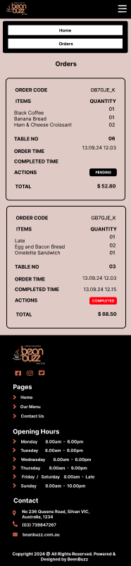

Tab View

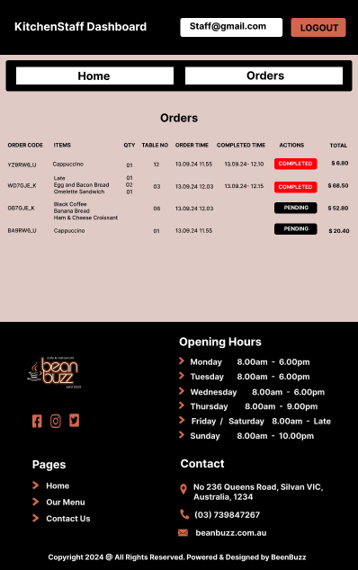

Desktop View

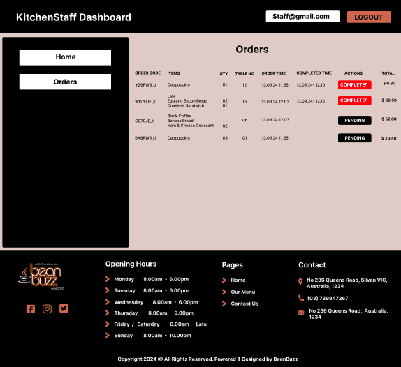

### Payment Page

The payment form is simple and straightforward, featuring only the essential fields: card details, cardholder name, expiry date, and CVC. The "Pay" button is easy to find for quick access.

Users can securely enter their payment information to complete the transaction, making the checkout process fast and easy.

It seamlessly integrates with the cart and order confirmation pages, serving as the final step in completing a purchase.

> <i>Click to view below</i>

Mobile View

Tab View

Desktop View

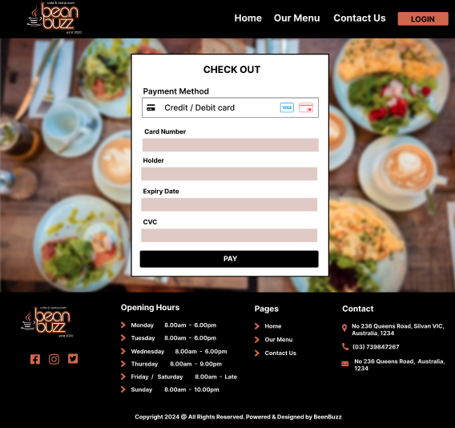

### Cart Popup Screen

The popup uses a centered modal window to draw attention to the key items, clearly listing the products, quantities, and prices. The subtotal and "Checkout" button are placed at the bottom for easy access.

Users can easily update item quantities or remove products from the cart. The "Checkout" button acts as a clear call to action, guiding users toward completing their purchase.

This popup is connected to the menu and integrates smoothly with the payment and checkout process, ensuring a seamless flow from product selection to final purchase.

> <i>Click to view below</i>

Mobile View

Tab View

Desktop View

### Filter Popup Screen

The filter sidebar is located on the left for easy access and visibility. It offers a range of filter options, like dietary preferences, organised in a way that makes navigation simple.

Users can easily apply or clear filters to narrow down their menu search. The "Apply" and "Clear All" buttons are straightforward, allowing for quick adjustments.

The filter panel directly updates the menu display, providing a dynamic and personalised experience as users refine their search.

> <i>Click to view below</i>

Mobile View

Tab View

Desktop View

 

# R6 - Task Allocation and Tracking

> Screenshots of your Trello (or similar kanban system) board throughout the duration of the project

### Overview

As a team, we used [Atlassian's Trello](https://trello.com/home), a visual project management tool, to keep our tasks organised and track their progress at every stage. The lists and their descriptions are designed with an Agile approach in mind, making it easy to manage tasks and stay updated on progress efficiently.

### Task Allocation

1. <b>Task Creation</b>

   - Tasks are created as individual Trello cards, representing a specific task or deliverable that needs to be addressed.

   - <b>Each card includes</b>
     - A detailed description of the task or goal.
     - Relevant attachments (documentation or links).
     - Checklists for subtasks required for completion.
     - Assigned team members.
     - Deadlines for time-sensitive tasks.

2. <b>Details and Deadlines</b>
   - Each card includes a detailed description, relevant attachments and checklists. This keeps us organised and ensures we have all necessary information to complete the task.

### Tracking Progress

1. Requirements</b>

   - Where all the initial project requirements and goals go. This list sets the foundation, outlining what the project needs and its constraints.

2. <b>API Routes</b>

   - Tracks the progress of backend API endpoints.

3. <b>README.md</b>

   - Keeps tabs on updates needed for the project documentation, making sure everything stays clear and up to date.

4. <b>Testing</b>

   - Contains tasks for creating and running tests to ensure everything works as expected.

5. <b>ReactApp</b>

   - Focuses on frontend development for the React app; designing, updating, and improving the user interface and experience.

6. <b>Todo</b>

   - The main backlog of tasks that are ready and prioritised to be worked on next.

7. <b>Doing</b>

   - Tracks tasks currently in progress to keep focus on what’s actively being worked on.

8. <b>Ongoing</b>

   - For tasks that need ongoing attention, like long term tasks or iterative work.

9. <b>Review</b>

   - Holds tasks waiting for review, like code quality checks, or final approvals.

10. <b>Refine</b>

    - Captures tasks that need more work after feedback or testing, ensuring continuous improvement.

11. <b>Done</b>

    - A record of completed tasks, showing all accomplishments and progress made.

12. <b>Stuck</b>

    - Flags tasks that are blocked. Whether due to unclear requirements, missing dependencies, or other issues, so they can be addressed during team discussions.

### Collaboration

Effective communication and regular updates are critical for managing tasks within the Trello board.

- Each card serves as a central place for discussions. Team members can leave comments, clarify requirements, ask questions, or share updates directly on the card.

1. <b>File Sharing</b>

   - Relevant files like mockups, code snippets, or documentation can be attached to cards, so everything we need is easy to find and in one place.

2. <b>Notifications</b>

   - Trello's notification system helps everyone stay on top of deadlines, updates, and assigned tasks, so nothing slips through the cracks.

### Review

1. <b>Regular Task Reviews</b>

   - Tasks are reviewed frequently to make sure they align with project goals and to catch any potential issues early. These reviews help keep everyone accountable and allow for quick adjustments to the workflow.

2. <b>Board Maintenance</b>

   - The board is regularly updated by archiving finished tasks, reorganising lists, and keeping everything clean and easy to use.

Trello Planning: Screenshots

<i>First Week</i>

<i>Second Week</i>

<i>Third Week</i>

Card Planning: Screenshots

<i>R1: Description of Website</i>

<i>R2: Dataflow Diagram</i>

<i>R3: Application Architecture Diagram</i>

<i>R4: User Stories</i>

<i>R5: Wireframes</i>

<i>R6: Task Planning</i>

 
