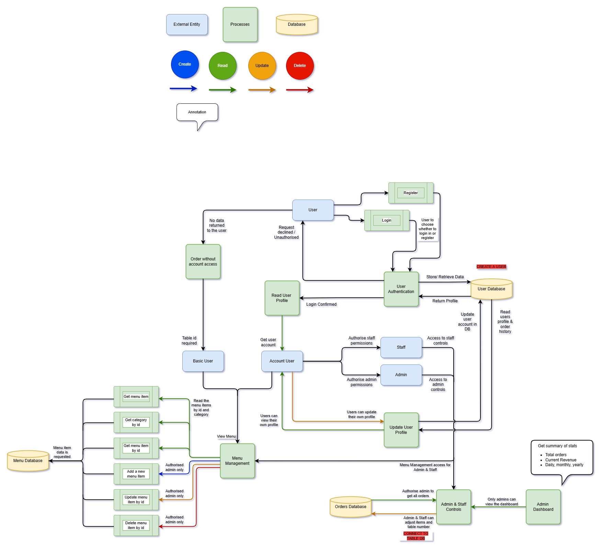
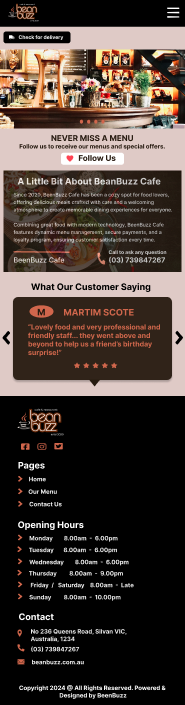
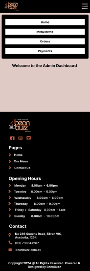
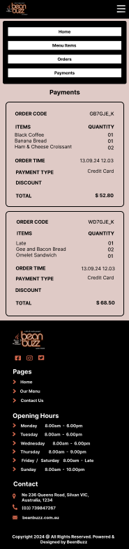
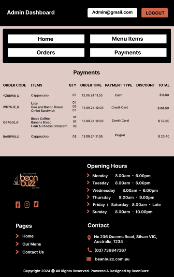
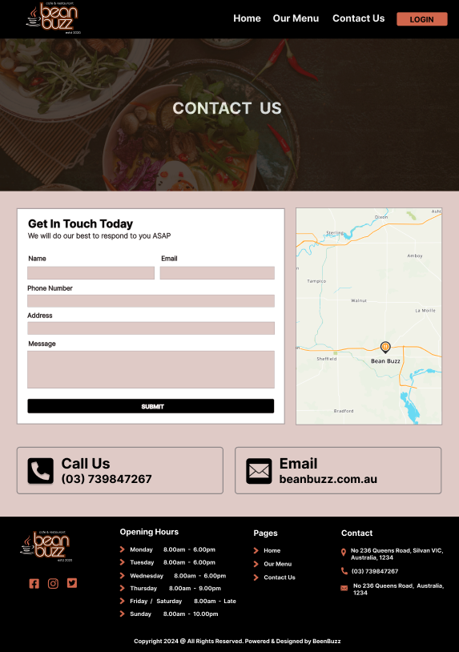
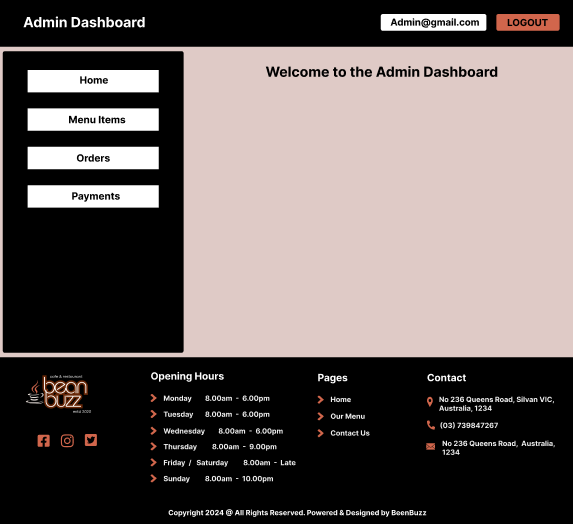
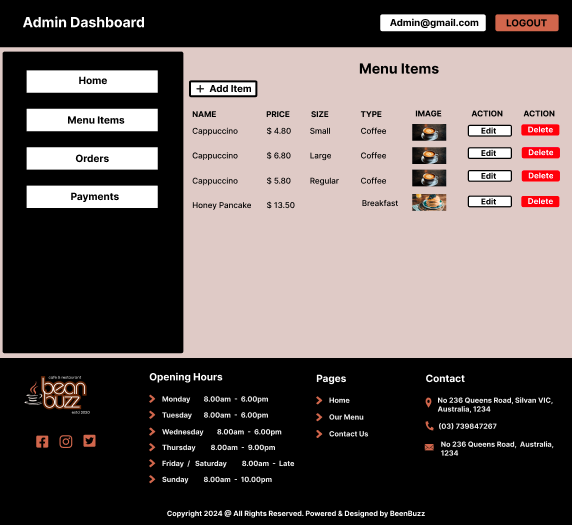

# R1 - Description of Website

## Purpose

Bean Buzz is a MERN stack application designed to address operational inefficiencies in cafes and restaurants while doubling as a portfolio piece to demonstrate Coder Academy graduates' expertise in front-end and back-end technologies, API design and data management within a professional and real-world application.

<b>Key Goals:</b>

- Showcase Expertise in modern web development practices.
- Solve real-world problems faced by food service businesses.
- Create a user focused tool with busuness enhancing features.

## Problem Statement

#### Inflexible Printed Menus

Cafes and restaurants are a dynamic environment. The food items available often change on both a seasonal and daily basis.

- On a seasonal basis, restaurants may need to create and remove menu items based on the ingredients that are available locally.
- On a daily basis, restaurants may need to toggle the availability of menu items based on the current amount of ingredients left available.

Over time, managing these changes on a printed menu can be time consuming and costly. This may discourage restaurants from experimenting with menu items and trying new things in the short-term.

#### Long Wait Times

Long wait times can really hurt the experience for takeaway customers. Without a clear way to track their order, they’re often left waiting and wondering if their food is ready or if it’s been forgotten. 
This gets even worse in busy places where the staff is too swamped to give regular updates. The lack of communication and transparency can leave customers feeling frustrated and less likely to come back, especially if other nearby options offer a smoother, more reliable experience.

#### Lost Paper Tickets for Orders

Paper order systems can be a real headache. Tickets get lost or damaged, causing delays, and unhappy customers. When things get busy, keeping track of what’s done and what still needs attention becomes a mess. 
Plus, trying to manage order history, revenue, and other important info manually takes way too much time and makes it harder to make smart business decisions. In the end, relying on paper slows everything down, makes life harder for staff, and leaves customers disappointed.

#### Customer Retention

Restaurants and cafes may struggle to give incentive for their customers to come back frequently. With so many places offering similar food and experiences, it’s hard to stand out and build loyalty.
This can lead to inconsistent revenue and make it tough to grow or stay sustainable in the long run. In areas packed with dining options, not focusing on customer loyalty can make it even harder to stand out and succeed.

## Features & Functionality

### For Customers

1.  <b>Dynamic Menu</b> 
    The app will feature a dynamic menu that can be filtered by customers based on a variety of dietary requirements. Cafe and Restaurant staff will also be able to toggle the availability of menu items - this ensures that customers are aware of the availability of menu items prior to ordering.

    - Filter by dietary needs (vegan, gluten free)
    - See real-time availability of menu items

2.  <b>Order Placement</b> 
    The app will feature an ordering system to allow users to select menu items, leave instructions / special requests and pay for their menu items.

    - Add items to cart, specify special requests and complete payment via Stripe

3.  <b>Order Tracking</b> 
    The app will feature an order tracking system to allow customers to view the status of their order.

    - Track the progress of orders from placement to completion

4.  <b>User Account Management</b> 
    Customers can create a personal account to save their preferences, past orders, and contact details for faster future transactions.
    Logged-in users can view and update their profile information, such as delivery addresses, payment details, and contact numbers.

5.  <b>User Loyalty Program</b> 
    Customers are given incentive to use the app and visit the cafe /restaurant in order to earn discounts after spending a certain amount of money or purchasing a certain amount of products.

    - Customers are rewarded for their loyalty through a points-based system, where they earn points for every purchase
    - The program offers transparency by allowing users to track their progress toward rewards directly within the app.

### For Businesses

1.  <b>Admin Dashboard</b> 
    Business owners will be able to create, update and delete menu items using a dashboard in the app.

    - Real-time updates to menu availability ensure customers see only what is currently available, minimising order issues related to unavailable items.
    - The dashboard includes analytics on menu performance, helping businesses identify bestsellers and underperforming items.

2.  <b>Order Dashboard</b> 
    Kitchen staff and business owners will be able to view past and present orders. Furthermore, they’ll be able to confirm or cancel present orders.

    - Kitchen staff and business owners can view all current, pending, and completed orders in one centralised system.
    - Orders are categorised by status (“In Progress,” “Completed”) to streamline kitchen operations and improve workflow efficiency.
    - Businesses can confirm or cancel orders directly through the dashboard, providing flexibility to address errors or handle special circumstances.

## Target Audience

The target audience for this application are restaurant / cafe owners, their staff and customers. Restaurant / cafe owners and their staff will use this application to streamline their business operations - keeping menus up-to-date and taking and managing orders. Customers will use this application to browse menu items, make orders and keep track of their rewards.

#### Primary Users:

1. <b>Cafe/Restaurant Owners</b>

   - Mange their operations seamlessly
   - Track orders, streamline menu updates, and gain customer insights

2. <b>Cafe/Restaurant Staff</b>
   - Simplify kitchen and front of house workflows
   - Reduce errors in order management

#### Secondary Users:

1. <b>Authenticated Customers</b>
   - Benefit from a personalised ordering experience with real-time updates, access to loyalty rewards, and saved preferences for quicker checkouts.
2. <b>Unauthenticated Customers</b>
   - Enjoy a simple and efficient ordering process with real-time updates, without needing to create an account.

## Tech stack

The application implements a variety of technologies associated with the MERN stack. They include the following:

### Front-end

1.  <b>React.js</b> 
    React.js is the front-end Javascript library that the app uses to render and update the user interface. The front-end of the application will be hosted on Netlify. - Renders the UI dynamically - Manages state for user interactions like menu filtering and order placement

### Back-end

1.  <b>Node.js</b> 
    Node.js allows the application to make use of a variety of web development frameworks and libraries such as express, mongoose and helmet.js.

    - Provides the runtime environment for the server side code.

2.  <b>Express.js</b> 
    Express.js is a web application framework for Node.js that is used to handle server-side logic such as authentication, authorisation and CRUD operations relating to menu-items, users and orders. The express server itself is hosted on Render.

    - Manages server logic like routing, authentication, and API endpoints.

### Database

1.  <b>MongoDB</b> 
    MongoDB is the NoSQL database used for this application hosted on Cloud Atlas.

    - Stores Collections for users, menu items, orders, and loyalty rewards
    - Hosted on Cloud Atlas for robust performance and scalability

### Payment Gateway

1.  <b>Stripe</b> 
    Stripe is the payment processing platform used by the application for customer orders.

    - Processes payments securely and integrates seamlessly with the app.

### Deployment

1. <b>Front-end</b> 

   - Deploy React.js on Netlify.

2. <b>Back-end</b> 

   - Deploy Node.js/Express on Render.

3. <b>Environment Variables</b> 
   - Storing sensitive information such as API keys and database URIs securely.

# R2 - Dataflow Diagram

### Overview

A Dataflow Diagram is a simple way to show how data moves through a system. It highlights the processes, data storage areas, and how external entities interact with the system. It's a handy tool for designing software, analysing systems, and mapping out processes.

1. <b>External Entities:</b> Represent users (basic user, account user, admin, staff).
2. <b>Processes:</b> Represent actions performed within the system (login, update user profile, menu management, order management).
3. <b>Data Stores:</b> Represent databases for menus, orders, tables, and users.
4. <b>Data Flow:</b> Depicted with arrows showing data input, processing, and output.

## Key Processes

### User Registration and Login

1. External Entity
   - User
2. Processes
   - <b>Register:</b> A user provides registration details, which are stored in the `User Database`
   - <b>Login:</b> Users input credentials to verify their identity. Verified users are categorised as:
     - <b>Basic User:</b> Can access limited functionalities.
     - <b>Account User:</b> Can access full account features (profile updates).
     - <b>Admin/Staff:</b> Get access to management controls for menus, orders, and tables.
   - <b>User Authentication:</b> Data flows from the User Database to confirm credentials.
3. Data Store:
   - User Database (Stores user details like name, email, and contact info).

### Menu Management

1. External Entity:
   - Admin
   - Staff
2. Processes:
   - <b>Read Menu:</b> Retrieve menu details from the `Menu Database`.
   - <b>Get Menu Items by Category:</b> Allows filtering based on categories.
   - <b>Add/Edit/Delete Menu Item:</b>
     - <b>Add:</b> New menu items are created in the database.
     - <b>Edit:</b> Updates existing menu details.
     - <b>Delete:</b> Removes items from the database.
3. Data Store: Menu Database (Stores menu items and associated details).

Menu data is also shared with `Order Management` for placing orders.

### Order Management

1. External Entity:
   - Basic Users
   - Account Users
   - Admin
   - Staff
2. Processes:
   - <b>Create an Order:</b> Users place orders, with details recorded in the `Orders Database`.
   - <b>Get Order by ID:</b> Retrieve specific order details.
   - <b>Update Order:</b> Modify order details (status).
   - <b>Submit Order:</b> Finalises the order for processing.
   - <b>Delete Order:</b> Cancel or remove orders.
3. Data Store: Orders Database (Stores order details such as items, quantities, user IDs, and status).

`Admins` and `Staff` can view order summaries for reporting purposes (daily totals, item counts).

### Table Management

1. External Entity:
   - Admin
   - Staff
2. Processes:
   - <b>Get All Tables:</b> Retrieve table details from the `Table Database`.
   - <b>Add/Edit/Delete Table:</b>
     - <b>Add:</b> Adds new table entries.
     - <b>Edit:</b> Updates existing table information (availability).
     - <b>Delete:</b> Removes tables from the system.
3. Data Store: Table Database (Tracks table numbers, availability, and statuses).

Table data is synchronised with `Order Management` for assigning orders to tables.

### User Profile Management

1. External Entity:
   - Account Users
2. Processes:
   - <b>Read User Profile:</b> Users retrieve their profile information from the `User Database`.
   - <b>Update User Profile:</b> Allows users to edit their account information.
3. Data Store: User Database

### System Roles and Permissions

1. Basic Users: Limited access (view menus, place orders).
2. Account Users: Extended access (profile updates).
3. Admin/Staff:
   - Manage menus, orders, and tables.
   - Access data summaries (order statistics).

 

Click here - Dataflow Diagram

<i>Revision 01</i>

<i>Revision 02</i>

 

# R4 - User Stories

### Overview

A user story is a simple way to explain a feature or function from the perspective of the person using it. It answers three key questions: <b><i>who’s</b></i> using it, <b><i>what</b></i> they want to do, and <b><i>why</b></i> it’s important to them. This helps ensure that features are designed with real users in mind and create a great experience.

- Who: Defines the type of user, like a customer, admin, or kitchen staff.
- What: Describes the action the user wants to take.
- Why: Explains the purpose or benefit behind the action, showing why it matters.

Our user stories have been refined throughout the creation of this app.  
The following are the multiple versions:

## User Stories - Version 1

### Dynamic Digital Menu

#### Customer

1. As a customer, I want to view a digital menu so I can see all food items available.

2. As a customer, I want to filter food items based on my dietary requirement (e.g, vegan or gluten free) so I can order food that is suitable for me.

### Online Ordering & Payment

#### Customer

1. As a customer, I want to be able to pay for my food online while heading to the cafe / restaurant so it will be ready to pick up when I get there.

2. As a customer, I want to be able to pay for my food online while dining in because it will save me time.

### Food Item Dashboard

#### Business Owner

1. As a business owner, I want to be able to view current food items so I know what’s being offered to customers.

2. As a business owner, I want to be able to update food items and keep them up-to-date if there are any changes that need to be made (like changes to price).

3. As a business owner, I want to be able to create food items so our business can periodically offer customers something new and interesting to try.

4. As a business owner, I want to be able to toggle the availability of food items on the digital menu to reflect what we currently have in stock, prevent customers from being disappointed and save our staff time in having to explain that certain items are not currently available.

### Order Dashboard

#### Customer

1. As a customer, I want to be able to track the current state of my order so I know when it’s ready for pickup.

#### Business Owner

1. As a business owner, I want to be able to track all orders (past and present) to keep up-to-date business records.

#### Kitchen Staff

1. As kitchen staff, I want to be able to view current orders along with the customer instructions associated with them, mark them as complete or cancel them.

### User Registration, Login and Loyalty Program

#### Customer

1. As a customer, I want to be able to register an account and login so I can keep track of my orders and know when they’re ready to pick up.

2. As a customer, I want to be able to accrue points so I can use them to order free food items.

#### Business Owner

1. As a business owner, I want to be able to provide an incentive for my customers to visit and order food regularly.

## User Stories - Version 2

### Dynamic Digital Menu

#### User

1. As a user, I want to view a digital menu so I can see all current food items. When doing so, i also want to know which food items are currently sold out so i do not order them.

#### Customer

1. As a customer, I want to filter food items based on my dietary requirement (e.g, vegan, gluten free, vegetarian, etc.) so I can order food that is suitable for me.

### Ordering

#### Customer

1. As a customer, I want to be able to add food items to a cart so I can continue to browse the menu.

2. As a customer, I want to be able to specify the quantity of food items I want to buy so i can order on behalf of everyone on my table.

3. As a customer, i want to be able to remove food items from my cart if I change my mind.

### Payment

#### Customer

1. As a customer, I want to be able to pay for my food online while heading to the cafe / restaurant so it will be ready to pick up when I get there.

2. As a customer, I want to be able to pay for my food online while dining-in because it will save me time in going to the counter and having to talk to staff.

3. As a customer, I want to be able to pay for my food in person with cash after I have placed my order online.

### Food-Item Dashboard

#### Business Owner

1. As a business owner, I want to be able to view current food items so I know what’s being offered to customers.

2. As a business owner, I want to be able to update food items and keep them up-to-date if there are any changes that need to be made (like changes to price).

3. As a business owner, I want to be able to create food items so our business can periodically offer customers something new and interesting dishes to try.

4. As a business owner, I want to be able to toggle the availability of food items on the digital menu to reflect what we currently have in stock, prevent customers from being disappointed and save our staff time in having to explain that certain items are sold out.

### Order Dashboard

#### Customer

1. As a customer, I want to be able to track the current state of my order so I know when it’s ready for pickup.

#### Business Owner

1. As a business owner, I want to be able to track all orders (past and present) to keep up-to-date business records.

#### Kitchen Staff

1. As kitchen staff, I want to be able to view current orders along with the customer instructions associated with them, mark them as complete or cancel them.

### User Registration, Login and Loyalty Program

#### Customer

1. As a customer, I want to be able to register an account and login so I can keep track of my orders and know when they’re ready to pick up.

2. As a customer, I want to be able to accrue points so I can use them to order free food items.

#### Business Owner

1. As a business owner, I want to be able to provide an incentive for my customers to visit and order food regularly.

## User Stories - Version 3

Our BeanBuzz app supports three types of users:

- Unauthenticated user (a user that is not logged in)
- Authenticated user (a user that has a registered account and is logged in)
- Admin (owner) or Staff User

### Unauthenticated User

1. As an unauthenticated user, I want to access the application and view menu items without needing to log in, so I can explore the options available.
2. As an unauthenticated user, I want to filter food items based on my dietary requirements (e.g., vegan or gluten-free) so I can find suitable food items easily.
3. As an unauthenticated user, I want to order food online without logging in, but I understand that I won't have access to order status updates or the loyalty program.
4. As an unauthenticated user, i want to be able to pay for my food online
5. As an unauthenticated user, i want to be able to register an account so i can login to track my orders and participate in the loyalty program
6. As an unauthenticated user, i want to be able to pay for my order online to save time.
7. As an unauthenticated user, i want to be able to pay for my order in person so i can use cash.

### Authenticated User

1. As a customer, I want to filter food items based on my dietary requirements (e.g., vegan or gluten-free) so I can order food online that suits my preferences.
2. As a customer, I want to pay for my food online while heading to the cafe or restaurant so I can save time during pick-up or delivery.
3. As a customer, I want to track the status of my orders (e.g., pending, preparing, completed) so I can stay updated.
4. As a customer, I want to access a loyalty program so I can earn points with each order and redeem them for free food items.
5. As a customer, i want to be able to pay for my order online to save time.
6. As a customer, i want to be able to pay for my order in person so i can use cash.

### Admin or Staff User

1. As an owner/admin, I want to log in to the app so I can manage the restaurant’s menu, orders, payments and overall operations.
2. As a business owner/admin, I want to view the current menu items so I know what is being offered to customers.
3. As a business owner/admin, I want to update menu items (e.g., prices, image or descriptions) so the menu remains accurate and up-to-date.
4. As a business owner/admin, I want to create new menu items so our restaurant can periodically offer new dishes to customers.
5. As a business owner/admin, I want to toggle the availability of menu items on the digital menu so I can reflect real-time stock levels, preventing customer disappointment and saving staff time.
6. As a business owner/admin, I want to track all orders (past and present) so I can maintain up-to-date business records and analyze order trends.
7. As a business owner/admin, I want to change the status of orders (e.g., pending, completed, canceled) to manage and organize operations effectively.
8. As kitchen staff, I want to view current orders along with any customer instructions so I can prepare the orders accurately.
9. As kitchen staff, I want to mark orders as pending, completed, or canceled so I can communicate their status to the customers.

# R5 - Wireframes for multiple standard screen sizes.

[Figma Wireframe Link](https://www.figma.com/design/opDtX5ia73tgRQuhVsJ3fT/Been-Buzz-Cafe-Wireframes?node-id=0-1&t=TIgoX4YxbvIukJd8-1)

### Overview

Designed high-fidelity wireframes for multiple standard screen sizes using Figma, the industry-standard design tool. These wireframes ensure a responsive and user-friendly layout across devices such as desktops, tablets, and mobile screens. That hepls reflecting the app's final design and functionality. Figma's collaborative features allowed our team to iterate and refine the designs efficiently, aligning with best practices for modern UI/UX development.

### Colour Selection

For the "BeanBuzz" app, we used the "Coolors" color palette generator to create a darker coffee-inspired color scheme for the wireframes. The rich, earthy tones of coffee beans capture the warmth and elegance of a cozy café atmosphere. This palette reflects the dining experience while creating a visually appealing and immersive interface, enhancing the user’s connection to the app.

- [Colour Theme 1](https://coolors.co/000000-251b0f-967c70-e8d4c4-f1f5f2)
- [Colour Theme 2](https://coolors.co/000000-241b17-e68541-f6f1ef-ffffff)
- [Colour Theme 3](https://coolors.co/000000-202738-c46c48-e7ddda-efefef)

Click here - Colour Themes Images

<i>Theme 01</i>

<i>Theme 02</i>

<i>Theme 03</i>

### Font Selection

When selecting fonts for our app, readability and modern appeal were top priorities. The chosen fonts create a clean, approachable aesthetic, making them perfectly suited for menu displays and user interfaces. These fonts work well together to create a consistent and welcoming design for the app. In the end, we chose:

- Open Sans
- Lato

### Wireframe - Mobile Version

We initiated the design process for the app by focusing on the mobile version. Using Figma, we chose the "iPhone 13 mini" view to ensure accurate design alignment.
Then devised the design for the mobile version as follows.

Click here - Home Page Mobile View

Click here - Our Menu Page Mobile View

Click here - Contact Page Mobile View

Click here - Admin Dashboard Mobile View

Click here - Admin Dashboard - Menu Panel Mobile View

Click here - Admin Dashboard - Order Panel Mobile View

Click here - Admin Dashboard - Payment Panel Mobile View

### Wireframe - Tab Version

For the tablet view in Figma, used the "Android Expanded" frame to ensure the design adapts smoothly to larger screens. This choice allows for an optimized, responsive layout across tablet devices.

Click here - Home Page Tab View

Click here - Our Menu Page Tab View

Click here - Contact Page Tab View

Click here - Admin Dashboard Tab View

Click here - Admin Dashboard - Menu Panel Tab View

Click here - Admin Dashboard - Order Panel Tab View

Click here - Admin Dashboard - Payment Panel Tab View

### Wireframe - Desktop Version

In Figma, we used the desktop frame for the desktop view to design an interface customized for larger screens. This approach ensures a smooth, responsive experience for users across desktop devices.

Click here - Home Page Desktop View

Click here - Our Menu Page Desktop View

Click here - Contact Page Desktop View

Click here - Admin Dashboard Desktop View

Click here - Admin Dashboard - Menu Panel Desktop View

Click here - Admin Dashboard - Order Panel Desktop View

Click here - Admin Dashboard - Payment Panel Tab View

